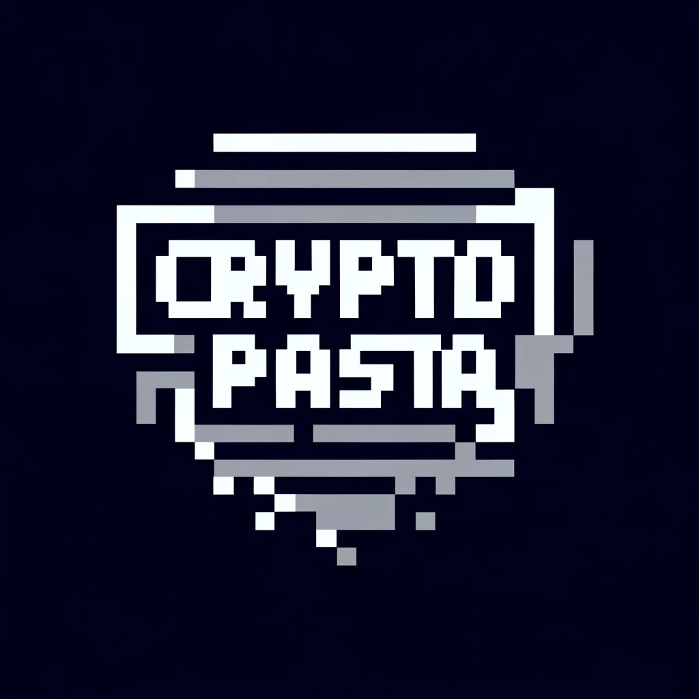

<div align="center">

<h1> Cryptopasta </h1>

<p align="center">
    The organization called `Cryptopasta` uncovers the truth behind the urban legend in the blockchain world.</br>
    Become an agent of Cryptopasta, the creator of new legends, and embark on a mission to identify threats</br> 
    through a text-based adventure game.
</p>
</div>

## Table of Contents

- [Getting Started](#getting-started)
  - [Installation](#installation)
- [Discover the Hidden Mysteries on the Blockchain with Cryptopasta](#discover-the-hidden-mysteries-on-the-blockchain-with-cryptopasta)
- [Problem Statement](#problem-statement)
- [Features: What brings Mass Adoption?](#features-what-brings-mass-adoption)
  - [1. Accessibility](#1-accessibility)
  - [2. Content](#2-content)
  - [3. Interactivity](#3-interactivity)
- [Challenges and Solutions](#challenges-and-solutions)
- [Future Work](#future-work)

## Getting Started

### Installation

1. Clone the repo

```sh
$ git clone https://github.com/piatoss3612/Cryptopasta.git
```

2. Change the directory

```sh
$ cd Cryptopasta
```

3. Deploy smart contracts

- [README](./contracts/README.md)

4. Setup the server

- [README](./server/README.md)

5. Setup the subgraphs

- [README](./subgraphs/README.md)

6. Setup the web app

- [README](./web/README.md)

7. Run the docker-compose

```sh
$ docker-compose up -d

or

$ make up
```

## Discover the Hidden Mysteries on the Blockchain with Cryptopasta

Inspired by the captivating world of Creepypasta, **Cryptopasta** brings urban legend storytelling to the blockchain realm. Imagine a hidden space between blockchain layers, inhabited by unknown entities, or a 'meme killer' that targets and eliminates meme coins.

Cryptopasta invites you to become an agent, crafting your own lore and exploring the blockchain through a thrilling text-based adventure game. Accessible to all, regardless of technical expertise, this game makes learning about blockchain concepts and terminology both fun and interactive.

## Problem Statement

Blockchain realms are often enigmatic, filled with complex concepts and terminology that can be challenging for newcomers. Despite the abundance of educational resources, they can be uninspiring and dry, making it difficult for users to retain information. To address this issue, we have created Cryptopasta, a text-based adventure game that merges interactive storytelling with blockchain technology. By allowing users to craft their own stories and explore the blockchain realm, Cryptopasta makes learning fun and engaging. Our goal is to attract a wider audience to the blockchain space and inspire a new generation of blockchain enthusiasts.

## Features: What brings Mass Adoption?

### 1. Accessibility

- **Social Login**: Users can log in using their social media accounts, making it easier for them to access the dApp.
- **Account Abstraction**:
  - Users can create a smart contract account and interact with the blockchain without knowing the underlying technology.
  - Paymaster can sponsor the transaction fees for users, making it easier for them to use the dApp.
  - Leveraging the native aa of zkSync, entire process of transaction is done in the protocol level without the third party involvement.
- **User-friendly Interface**: The UI is designed to be user-friendly, with a simple and intuitive layout that guides users through the game.

### 2. Content

- **User-generated Content**: Users can create their own stories and share them with the community, adding to the lore of Cryptopasta. Also they can earn rewards for their creativity and contribution.
- **Blockchain Integration**: By integrating blockchain technology surrounding the game, each story created by users is tokenized and stored on the blockchain, ensuring transparency and immutability. Inspiring scenes while playing the game are also can be captured and stored on the blockchain as NFTs.
- **Educational Content**: The game is designed to be educational, teaching users about blockchain concepts and terminology in a fun and interactive way.

### 3. Interactivity

- **Interactive Storytelling**: The game is an interactive text-based adventure powered by AI, allowing users to craft their own stories and explore the blockchain realm.
- **Community Engagement**: Users can share their stories, and rate the stories of others, fostering a sense of community and collaboration.
- **Ownership and Rewards**: Users can claim ownership of their stories and earn rewards for their contributions.

## Challenges and Solutions

## Future Work
