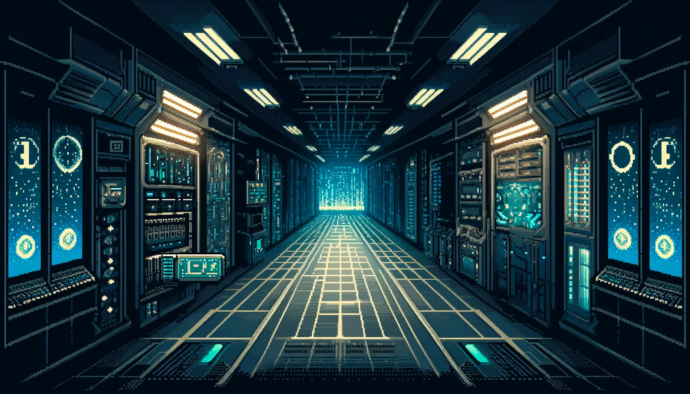

<div align="center">

<h1>Cryptopasta</h1>

<h3>Dive into Blockchain Mysteries with Cryptopasta</h3>
</div>

## Table of Contents

- [Getting Started](#getting-started)
  - [Prerequisites](#prerequisites)
  - [Installation](#installation)
- [Discover the Hidden Mysteries on the Blockchain with Cryptopasta](#discover-the-hidden-mysteries-on-the-blockchain-with-cryptopasta)
- [Problem Statement](#problem-statement)
- [Features](#features)
  - [1. Accessibility](#1-accessibility)
  - [2. Content](#2-content)
  - [3. Interactivity](#3-interactivity)
- [Challenges and Solutions](#challenges-and-solutions)
- [Future Work](#future-work)
- [Team](#team)
- [License](#license)

## Getting Started

### Prerequisites

Ensure you have the following installed:

- [Node.js](https://nodejs.org/)
- [Docker](https://www.docker.com/)
- [Git](https://git-scm.com/)
- [Make (Optional)](https://www.gnu.org/software/make/)

### Installation

1. Clone the repo

```sh
$ git clone https://github.com/piatoss3612/Cryptopasta.git
```

2. Change the directory

```sh
$ cd Cryptopasta
```

3. Deploy smart contracts

- [README](./contracts/README.md)

4. Setup the server

- [README](./server/README.md)

5. Setup the subgraphs

- [README](./subgraphs/README.md)

6. Setup the web app

- [README](./web/README.md)

7. Run the docker-compose

```sh
$ docker-compose up -d

or

$ make up
```

## Discover the Hidden Mysteries on the Blockchain with Cryptopasta

Inspired by the captivating world of Creepypasta, **Cryptopasta** brings urban legend storytelling to the blockchain realm. Imagine a hidden space between blockchain layers, inhabited by unknown entities, or a 'meme killer' that targets and eliminates meme coins.

Cryptopasta invites you to become an agent, crafting your own lore and exploring the blockchain through a thrilling text-based adventure game. Accessible to all, regardless of technical expertise, this game makes learning about blockchain concepts and terminology both fun and interactive.

<div align="center">

</div>

## Problem Statement

Blockchain realms are often enigmatic, filled with complex concepts and terminology that can be challenging for newcomers. Despite the abundance of educational resources, they can be uninspiring and dry, making it difficult for users to retain information. To address this issue, we have created Cryptopasta, a text-based adventure game that merges interactive storytelling with blockchain technology. By allowing users to craft their own stories and explore the blockchain realm, Cryptopasta makes learning fun and engaging. Our goal is to attract a wider audience to the blockchain space and inspire a new generation of blockchain enthusiasts.

## Features

### 1. Accessibility

- **Social Login**: Users can log in using their social media accounts, simplifying access to the dApp.
- **Account Abstraction**:
  - Users can create smart contract accounts and interact with the blockchain without needing to understand the underlying technology.
  - Transaction fees can be sponsored by a Paymaster, making it easier for users to use the dApp.
  - The native account abstraction (AA) of zkSync allows transactions to be processed at the protocol level without third-party involvement.
- **User-friendly Interface**: The UI is designed to be intuitive, guiding users through the game with ease.
- **USD Pricing**: Implement USD-based pricing for transactions to enhance user convenience and reduce complexity associated with cryptocurrency price fluctuations.

### 2. Content

- **User-generated Content**: Users can create and share their own stories, contributing to the Cryptopasta lore and earning rewards for their creativity.
- **Blockchain Integration**: Each user-created story is tokenized and stored on the blockchain, ensuring transparency and immutability. Memorable game scenes can also be captured and stored as NFTs.
- **Onboarding to the Blockchain**: The game can introduce newcomers to blockchain concepts and terminology in an engaging and interactive manner.

### 3. Interactivity

- **Interactive Storytelling**: The game features an AI-powered, text-based adventure where users can craft their own stories and explore the blockchain realm. Each choice impacts the storyline, creating a unique experience for every player.
- **Community Engagement**: Users can share their stories within the community, rate and comment on others' stories, and participate in discussions. This fosters a sense of community and collaboration, encouraging users to learn from one another.
- **Ownership and Rewards**: Users retain ownership of their stories, which are tokenized on the blockchain. They can earn rewards for their contributions, such as creating popular stories or completing community challenges.

## Challenges and Solutions

### 1. Hardhat vs Foundry

#### Challenge

- Attempted to use [foundry-zksync](https://github.com/matter-labs/foundry-zksync) for smart contract development.
- Required `via-ir` flag to compile, which is slow on my machine.
- Bytecode differs from that generated by Hardhat, causing the account abstraction contract to malfunction.
- Contract verification is not supported yet.

#### Solution

- Chose Hardhat for stable smart contract development.
- Added missing features (e.g., safeTransfer Receiver, multicall) to the account abstraction contract to ensure proper functionality.

### 2. Ollama vs OpenAI

#### Challenge

- Considered using Ollama, a local LLM framework, for the AI-powered text-based adventure game.
- My machine's GPU is insufficient for the required computations.
- Running it on the cloud would be costly and time-consuming.

#### Solution

- Opted for OpenAI's GPT-4o model, which is more powerful and efficient for testing and development.
- GPT-4o enhances gameplay, making it more natural and engaging, providing a better user experience.

### 3. AI Integration with Blockchain

#### Challenge

- Initially designed to integrate AI with the blockchain for transparency, immutability, and interaction cost tracking.
- This approach required users to pay for each AI interaction, which could be costly and deter gameplay.
- Chainlink functions are not supported on the zkSync network and cannot be used with native account abstraction of zkSync.

#### Solution

- Decided to keep AI operations off-chain to reduce costs and improve user experience.
- The game is played off-chain, with only selected storylines tokenized and stored on the blockchain.
- This approach ensures users can enjoy the game without incurring high transaction fees, making it more accessible and engaging.

### 4. WebSocket vs Server-Sent Events (SSE)

#### Challenge

- Currently using WebSocket for real-time interactions between the web app and the server.
- WebSocket is bidirectional and can handle multiple connections, but it requires more resources and may not scale well.
- SSE is a more lightweight alternative that can handle real-time updates in unidirectional communication from the server to the client.

#### Solution

- Consider switching to SSE for real-time updates in the web app and server communication to improve scalability and resource efficiency.

## Future Work

- **Credits and Rewards System**: Introduce a credit system to manage and limit the number of interactions a user can have with the game, preventing excessive resource consumption. Implement a reward mechanism where users receive incentives based on the quality and popularity of their stories, promoting creativity and active participation.

- **Governance Mechanism**: Establish a Decentralized Autonomous Organization (DAO) to allow the community to vote on qualified stories and manage reward distribution. This approach ensures transparency, fairness, and community involvement in decision-making processes. Community members can propose and vote on new features, improvements, and content.

- **Community Discussions and Forums**: Develop a dedicated platform for users to discuss stories, share tips, and collaborate on new ideas. This space would enhance community engagement, foster collaboration, and support the exchange of knowledge and experiences.

## Team

|  |
| ------------------------------------------------------------------------------------------ |
| [piatoss3612](https://github.com/piatoss3612)                                              |
| Fullstack Developer                                                                        |
| piatoss3612@gmail.com                                                                      |
| Attract the world to the blockchain!                                                       |

## License

This project is licensed under the MIT License. See the [LICENSE](./LICENSE) file for more details.
